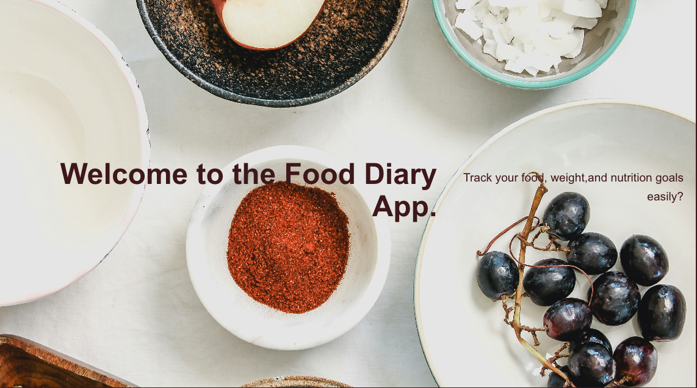

# Food Diary App
 

## About

## Getting started

Depolyed links:

front End:

Back end:https://git.heroku.com/food-diary-app.git

trello board link:https://trello.com/b/Qhadbsu5/food-diary-full-stack-mern-app

## Attributions
YouTube
ChaptGPT 
projects in class, Hoot Front and Back End, Pets front and Back end
JWT Authorization

## Technologies used
HTML
CSS
Javscript
React
MongoDB
Node js

## Next Steps
learn React Material UI, css modules, and styled components
add upload and display images with cloudinary

